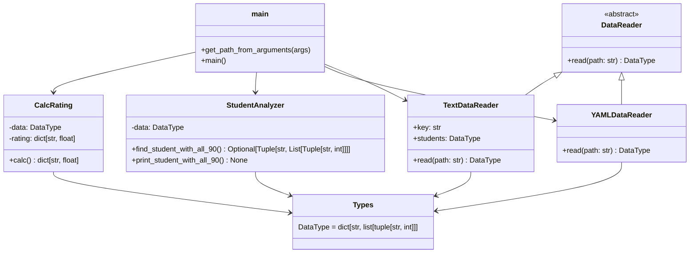

# Лабораторная 1 по дисциплине "Технологии программирования"
## Постановка задачи

Необходимо разработать программное решение, которое:

считывает данные о студентах и их оценках из файла (.txt или .yaml);

вычисляет средний балл каждого студента по всем дисциплинам;

определяет и выводит на экран студента, имеющего 90 баллов по всем предметам;

при отсутствии таких студентов выводит соответствующее сообщение;

реализует модульную структуру проекта, включающую классы для чтения данных, анализа и вычислений;

обеспечивает покрытие логики модульными тестами.

## Краткое описание проекта

Программа предназначена для анализа данных об успеваемости студентов.
Система построена на принципах объектно-ориентированного программирования (ООП) и имеет чёткое разделение ответственности между компонентами.

Архитектура включает:

DataReader (абстрактный класс) — интерфейс для всех типов источников данных.

TextDataReader и YAMLDataReader — конкретные реализации чтения данных из .txt и .yaml файлов.

CalcRating — модуль, рассчитывающий средние оценки студентов.

StudentAnalyzer — модуль, определяющий студентов с 90 баллами по всем предметам.

main.py — точка входа, связывающая все модули.

## Используемые языки, библиотеки и технологии
Компонент - Описание
Язык программирования - Python 3.11
Стиль кодирования - PEP8
Тестирование - pytest
Работа с YAML - PyYAML

## UML диаграмма проекта

## Выводы по работе

Разработано полностью функционирующее приложение с модульной структурой.

Реализованы классы для чтения данных из разных форматов (текст и YAML).

Выполнена инкапсуляция логики анализа и вычислений в отдельных классах.

Все тесты проходят успешно.